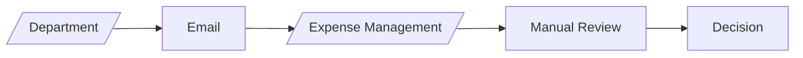
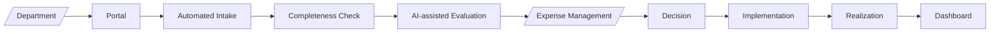

# Business Case Automation

This is an automated Business Case Management and Evaluation framework for the Expense Management division of a financial service company.

## Purpose

This repository defines the project governance, evaluation methodology, and technology blueprint for automating the intake, assessment, routing, approval, tracking, and realization of business cases submitted by departments.
The ends of the new process are:
  1. Reduced evaluation lead-time
  2. Trackings of expenditure requests
  3. Improved evaluation consistency
  4. Visibility of plan versus realization

### Current process



### Target outcome



## Design principle

> **AI recommends. Expense Management decides.**

The system should automate information collection, quality checks, scoring preparation, red-flag detection, routing, tracking, and reporting. Final accountability for decisions made remains with the authorized decision makers.

---

# Three-layer architecture

The solution is separated into three layers.

```text
┌─────────────────────────────────────────────────────────────┐
│ LAYER 1 — PROJECT GOVERNANCE                                │
│ What constitutes a good business case?                      │
│ Strategy | Financials | Expense | Value for Money           │
└───────────────────────────────┬─────────────────────────────┘
                                │
┌───────────────────────────────▼─────────────────────────────┐
│ LAYER 2 — EVALUATION ENGINE                                 │
│ How is the business case evaluated consistently?            │
│ Rules | Scoring | AI prompts | Red flags | Routing          │
└───────────────────────────────┬─────────────────────────────┘
                                │
┌───────────────────────────────▼─────────────────────────────┐
│ LAYER 3 — TECHNOLOGY IMPLEMENTATION                         │
│ How is the methodology operationalized?                     │
│ Portal | Workflow | Database | AI | Dashboard | Integration │
└─────────────────────────────────────────────────────────────┘
```

## Repository structure

```text
business-case-automation/
├── README.md
├── CONTRIBUTING.md
├── docs/
│   ├── 01-business-governance/
│   ├── 02-evaluation-engine/
│   └── 03-technology/
├── architecture/
├── ai/
├── templates/
├── data/
├── governance/
├── decisions/
└── .github/
    └── ISSUE_TEMPLATE/
```

## Four dimensions of evaluation
| Dimension | Weight |
|----|---:|
| Strategic Alignment | 30% |
| Financial Impact | 30% |
| Expense Impact | 20% |
| Value for Money | 20% |

## Status
**Version:** 0.1 - Design / MVP definition
This repository is a living showcase product and document.

## Roadmap

1. Define governance and scoring framework
2. Standardize intake
3. Implement tracking
4. Implement automated completeness checks
5. Implement AI-assisted evaluation
6. Implement workflow and approval routing
7. Implement dashboard
8. Add realization tracking
9. Calibrate scoring using historical cases
10. Establish continuous governance
